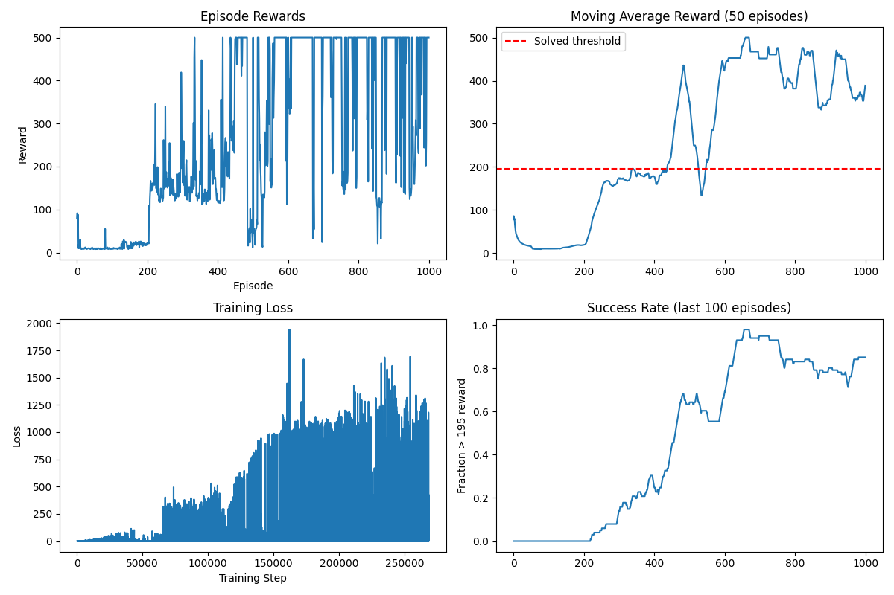

# jax-dqn-scalable
Scalable Deep Q-Learning implementation in JAX

# Key Results
Perfect CartPole performance: Consistent 500-step episodes
Optimized hyperparameters

# Core Components:

-DQNAgent: Q-learning with target networks and epsilon-greedy exploration
-VectorizedEnvironment: Parallel environment processing for efficient data collection
-ReplayBuffer: Experience storage with random sampling

# Training Pipeline:
Collect experiences → Store in replay buffer → Sample batches → Update Q-network → Copy to target network periodically

## Features (Planned)
- [x] JAX-based neural network implementation
- [x] Vectorized environment processing
- [x] Bayesian hyperparameter optimization
- [ ] Performance benchmarking vs PyTorch
- [x]  evaluation metrics

## Quick Start
git clone https://github.com/lucasdbkern/jax-dqn-scalable.git
cd jax-dqn-scalable
pip install -r requirements.txt

## Project Log 

The original Deep Q-learning paper marked a turning point, proving that deep learning could match or exceed human performance in complex, high-dimensional control tasks, something considered out of reach even a couple of years prior. 

The idea behind Deep Q-learning goes as follows: use a deep neural network to approximate the Q-function, which estimates the reward of taking a given action in a given state while also taking into account how this action affects the reward of the steps possible after the current one. While previous Q-learning used look up tables, here the neural network learns these relationships from scratch through training. 

Building the DQN from scratch revealed both its conceptual elegance, how far a few principled components can go, and that as so often plenty of complexity hides in implementation. Despite having the architecture and algorithmic outline in front of me -already validated! -  inferring which and why methodogical details impacted learning was challenging. Results were highly sensitive to seemingly minor hyperparameters such as learning rate, batch size, and network depth.

After building the agent, (vectorised) environment, buffer and training method, I first let the training module run for 100 episodes. 

Which looked fine enough, given that it was only learning for 100 episodes. Pasting in the 1000 episodes really showed how unstable learning can be without a target network or tuned hyperparameters.

 

 To improve this issue, I next built a hyperparameter optimiser:

 

 After running another training round with these new sets of hyperparameters and the addition of a target network, we could see that indeed, stability and performance had improved:

 

 This little project of mine once again shows that there is a difference between understanding an algorithm on paper and going into the nitty gritty. Implementing always brings up unexpected challenges. Although there is still much more I could improve, such as additional tuning, code components such as double DQN etc which have been developed after the paper, what I have so far serves as a good baseline. 